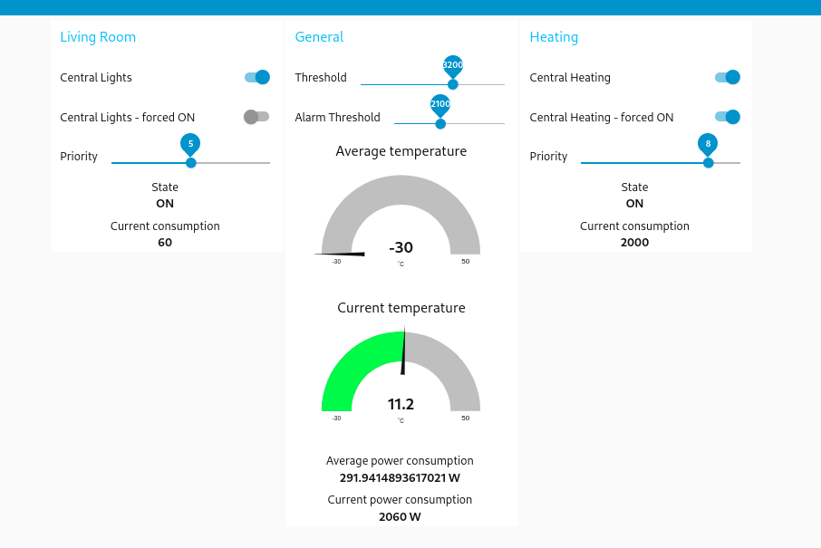

# IoT Virtual Home

Subject: 11769 - Connectivitat i Integració de Sistemes a IoT

### Architecture of the system

### Development
Each flow has its own file in the `flows/` directory.
In flow `general.json`, there are global configurations for MQTT Broker, InfluxDB, Dashboard - if you create some general configuration shared in different flows, just add it here.

### Dashboard
Current dashboard with possibility to turn ON/OFF appliance, see current and average temperature and moreover, Average power consumption of appliances for the whole house.

##### Data are periodically sent to the Sentilo platform

### How to run
1. Run MQTT Broker (configuration is for localhost:1883) - you can run `mosquitto`
2. Run InfluxDB (section `InfluxDB`)
2. Fetch all dependencies - `npm install`
3. Start Node-Red - `npm start`
4. Navigate to `localhost:1880`

### Import flows
1. All flows are located in the `flows/` directory
2. Unfortunately, we need to import them **one by one**
3. Tap `Ctrl+I`
4. Select a file from your filesystem - in the Clipboard tab
5. Click `Import`
6. Click `View nodes...` in the alert on top of the page
7. Just `Import Selected` **without replacing anything**
8. Provide all tokens - InfluxDB, Telegram

### Available URLs
- Node-Red - `localhost:1880`
- Node-Red UI Dashboard - `localhost:1880/ui`
- InfluxDB - `localhost:8086`

### InfluxDB

#### General
1. Download InfluxDB 2.0 from official website - https://portal.influxdata.com/downloads/
2. Run InfluxDB Daemon - `influxd` script in the downloaded folder 
   1. `./influxd` - Linux
   2. `.\influxd.exe` - Windows

#### First set up
1. Navigate in browser to `localhost:8086`
2. Set your username and password
3. Set initial organization name to `alinaMartin`
4. Set initial bucket name to `home1`
5. Click to 'Configure Later'
6. Go to `localhost:8086` and navigate to `Load Data` and then `API Tokens`
WARNING: **The API token is visible only once!**
7. If you're able to see your account's API token, save it
8. If not, just click to `Generate API Token` and create `All Access API Token` and save it
9. In the Node-Red (`localhost:1880`) go to some InfluxDB element and configure the instance

10. Add the saved token there
11. Click `Deploy`

#### Normal startup
1. Just run the `influxd` daemon
2. You can find received data on `localhost:8086` in section Data Explorer

